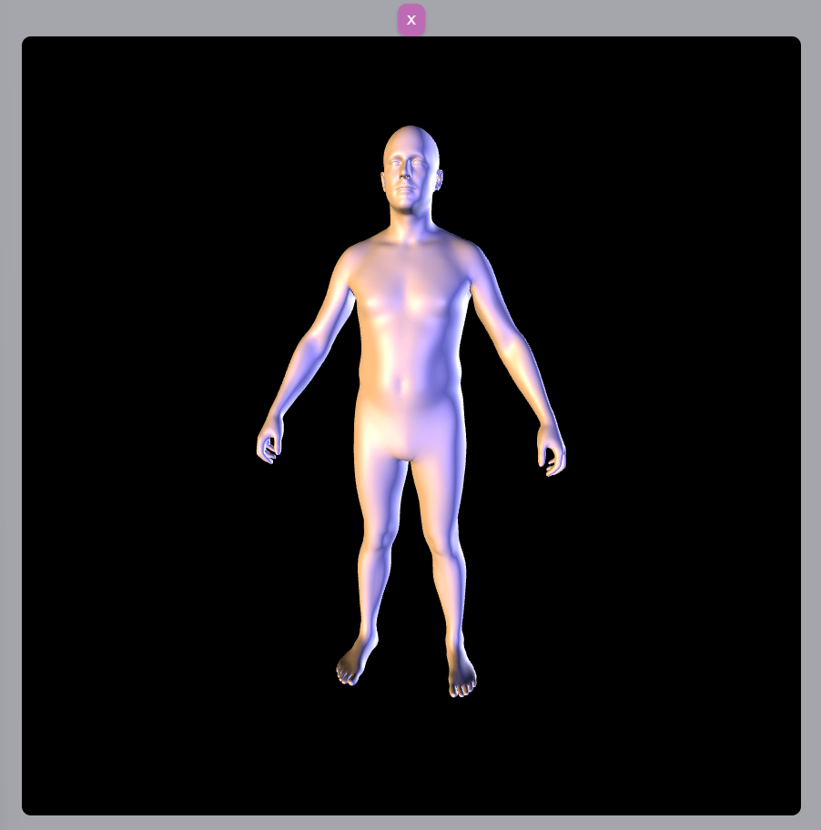

# 3js Model Modal

This model modal was created using React and 3js. This is a modal of a person in 3d using an OBJ File. You can zoom and rotate this model in any orientation.

# Highlights

One of the difficulties when creating the 3js model is that it doesn't resize whenever you resize the page. At first, I attempted to use link the dimensions of the browser to the dimensions of the 3js modal with react states. However, the model stayed the same size once it has been mounted to the page once and loaded with 3js. To fix this problem, I added an event listened for page resizing that, once run, will use the renderer to readjust the size of the model. This will prevent additional reloads of the model, camera, animate function, etc. and increase the efficiency of my app. 

